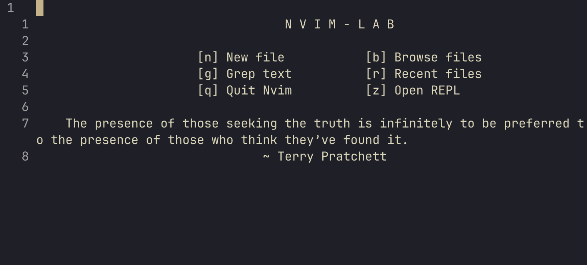

# nvim-lab: Neovim for Scientists 🧪


[](https://github.com/thosvarley/nvim-lab/releases)

**nvim-lab** is a specialized [Neovim](https://github.com/neovim/neovim) configuration aimed at providing an efficient and customizable environment for scientists and researchers in both academia and industry. This configuration comes pre-loaded with the necessary tools for scientific programming, data analysis, visualization, and manuscript preparation in LaTeX. It includes support for popular scientific languages such as Python, Julia, and R, as well as a suite of quality-of-life plugins to enhance productivity.

Whether you are working on data science, machine learning, scientific computing, or writing research papers, **nvim-lab** has you covered.

### Table of Contents

- [Introduction](#introduction)
- [Features](#features)
- [Installation](#installation)
- [Plugins](#plugins)
- [Usage](#usage)
- [Supported Languages](#supported-languages)
- [Future Work](#future-work)
- [License](#license)
- [Contact](#contact)

### Introduction

**nvim-lab** is designed to create a seamless experience for scientists, engineers, and researchers who need a robust text editor for both coding and writing. It is tailored for scientific workflows, making it a powerful tool for tasks like:

- Writing and editing scientific papers in LaTeX.
- Writing code in Python, Julia, R, Rust, Haskell, and Lua.
- Interactive data analysis and visualization.
- Seamless integration with external tools and REPLs (Read-Eval-Print-Loop).

This configuration is built around **Neovim**, which offers high performance, extensibility, and a responsive user experience. It is fully customizable and easily extendable for a wide range of scientific workflows.

You can find the latest releases of **nvim-lab** [here](https://github.com/thosvarley/nvim-lab/releases).

### Features

- **Multi-Language Support**: LSP (Language Server Protocol) support for Python, R, Julia, Lua, Haskell, and Rust. This ensures that you have code completion, linting, and error checking, as well as advanced refactoring and debugging features.
  
- **LaTeX Integration**: Use Neovim to write and compile LaTeX documents directly. Ideal for writing research papers, thesis, and any academic documentation.

- **REPL Support**: Integrated support for running interactive REPLs for Python, Julia, R, and more. This allows you to evaluate code snippets on the fly without leaving Neovim.

- **Quality-of-Life Plugins**: A suite of plugins that enhance your workflow, including `Telescope` for fuzzy finding, `Oil` for file exploration, and `Molten` for managing interactive sessions. These plugins speed up navigation, file management, and interactive work.

- **Customizable Workflow**: **nvim-lab** is highly configurable. Customize the setup to fit your specific research needs, whether you're working on large-scale data analysis, machine learning projects, or writing papers.

- **Scientific Toolbox**: Pre-configured utilities to make it easy to analyze, plot, and visualize data from within Neovim.

### Installation

To get started with **nvim-lab**, follow the steps below:

#### Prerequisites

- **Neovim**: Ensure you have [Neovim](https://neovim.io/) +v0.11 installed.
- **Python, Julia, and R**: Make sure the programming languages you intend to use (e.g., Python, Julia, R) are installed on your machine.
- **Rust & Haskell**: Optional, but needed for full support if you plan to use Rust or Haskell.

#### Steps

1. **Clone the Repository**:
   Clone the **nvim-lab** repository to your local machine:

   ```bash
   git clone https://github.com/thosvarley/nvim-lab.git
   cd nvim-lab
    ```

2.  **Install Dependencies**:
    Install Language Servers: nvim-lab uses LSP for code intelligence. The configuration will attempt to install the required servers for Python, Julia, and R. You can manually install them or use the plugin manager to automate this.

    For Python: `pip install 'python-language-server[all]'`

    For Julia: `using Pkg; Pkg.add("LanguageServer")`

    For R: `install.packages("languageserver")`

    **REPL Support**:
    The [IronREPL](https://github.com/Vigemus/iron.nvim) plugin provides REPL support for all the major languages. 
    Generally speaking, it should work out-of-the-box for Python, Julia, Lua, and R, as those languages have REPLs as part of the default installation.
    For Rust REPL support, we use [evcxr](https://github.com/evcxr/evcxr), which can be installed with `cargo install evcxr`.

    **Additional Dependencies**
    
    - The [**MarkdownPreview**](https://github.com/iamcco/markdown-preview.nvim) plugin requires NPM and Node.js, which can be installed through your system package manager. 
    - [**VimTex**](https://github.com/lervag/vimtex/) requires a full LaTeX installation, and optionally the [**Zathura**](https://github.com/pwmt/zathura) Document view for an Overleaf-like live compilation. 


### Plugins

Nvim-lab uses the [Lazy plugin manager](https://github.com/folke/lazy.nvim) to manage plugins. 
All plugins can be found in `lua/plugins/`. Lazy should auto-install all plugins, although you can run `:Lazy update` to be sure that all plugins are installed and up-to-day.
nvim-lab comes pre-configured with a number of carefully chosen plugins to improve your productivity and enhance your scientific workflow:

- [**Telescope**](https://github.com/nvim-telescope/telescope.nvim): For fuzzy finding files, buffers, and searching through your project. Also includes the [Telescope file-browserhl](https://github.com/nvim-telescope/telescope-file-browser.nvim), and [Bibtex integration](https://github.com/nvim-telescope/telescope-bibtex.nvim).
- [**Molten**](https://github.com/benlubas/molten-nvim): For a Jupyter Notebook-like experience, Molten supports interactively running code with the jupyter kernel. 
- [**Oil**](https://github.com/stevearc/oil.nvim): A file explorer that lets you create, delete, move, and modify your file tree all within a buffer.
- [**IronREPL**](https://github.com/Vigemus/iron.nvim): Provides interactive REPL support for multiple languages including Python, Julia, and R.
- [**VimTex**](https://github.com/lervag/vimtex/): LaTeX editing and compiling within Neovim.
- [**Fugitive**](https://github.com/tpope/vim-fugitive): Git integration.
- [**Mason**](https://github.com/stevearc/oil.nvim): A package manager for LSPs, linters, formatters, DAPs and more. Most languge support in Nvim-Lab is done via Mason (excluding Julia). 
- Code completion and suggestion suing [**cmp**](https://github.com/hrsh7th/nvim-cmp) and [**friendly snippets**](https://github.com/rafamadriz/friendly-snippets). Auto-generate docstrings and annotations using [**neogen**](https://github.com/danymat/neogen).

- And more, including color themes, [Lualine](https://github.com/danymat/neogen) status bar, and other basic Quality-of-Life plugins.

### Usage

Once installed, nvim-lab will be ready to use. 
Entering `nvim` will take you to the splash page:


To see a list of available keybindings using the [Which-key](https://github.com/folke/which-key.nvim) plugin, enter the command `:WhichKey`.

### Supported Languages

Nvim-lab has built-in LSP support for the following languages:

- Python: Full LSP support + linting and formatting provided by Ruff.
- Julia: Full LSP support from Julias native language server.
- R: Full LSP support from R's native language server.
- Rust: Full LSP and formating support from [rust-analyzer](https://github.com/rust-lang/rust-analyzer).
- Haskell: Full LSP support.
- Lua: Lightweight scripting language, used within Neovim itself.
- LaTeX: LaTeX support and compilation provided by VimTex.
- C/C++: LSP support provided by [clangd](https://clangd.llvm.org/). 

### Future work
We welcome contributions to improve nvim-lab! Whether it's fixing bugs, improving documentation, or adding new features, your help is greatly appreciated.

Here’s how you can contribute:

 - Fork the repository and create your own branch.
 - Make your changes and test them locally.
 - Submit a pull request for review.

Please ensure that your code follows the existing style conventions and include tests if applicable.
License

### License

This project is licensed under the Apache License (v2.0). See the LICENSE file for more details.
**Please credit the original Nvim-Lab contributors in future forks.

### Contact

If you have any questions, suggestions, or issues, feel to reach out:

- **Github**: @thosvarley
- **Email**: contact[at]thosvarley[dot]me
